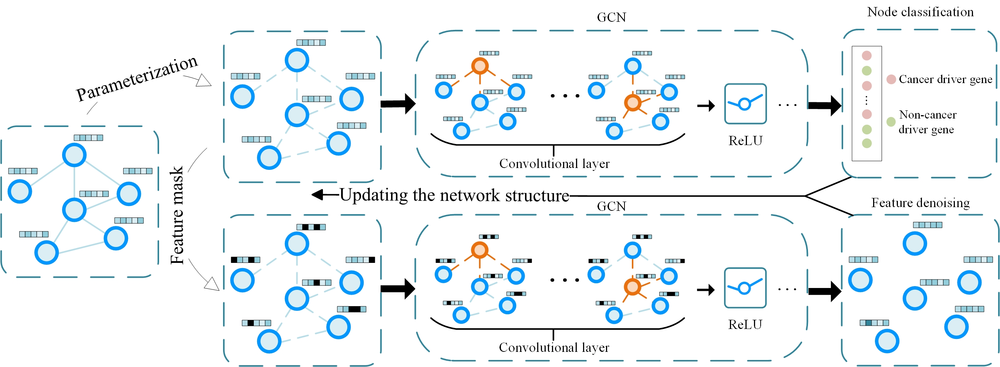

## SSCI

This repo contains the implementation of the model proposed in `SSCI: self-supervised deep learning improves network structure for cancer driver gene identification`



### Dependencies

- `python` 3.10.13
- `numpy` 1.26.1

* `torch` 1.11.0-cu113-cp310
* `scikit-learn`  1.3.2
* `torch-geometric  ` 2.5.0

* `joblib` 1.3.2
* `pandas ` 2.2.2
* `gcforest ` [https://github.com/LAMDA-NJU/Deep-Forest](https://github.com/LAMDA-NJU/Deep-Forest)

### Hyperparameter

* `epochs`: The number of epochs to train.
* `lr_c`: Learning rate of GCN_C.
* `lr_r`: Learning rate of GCN_R.
* `lr_adj`: Learning rate of adj.
* `w_decay_c`: Weight decay of GCN_C.
* `w_decay_r`: Weight decay of GCN_R.
* `w_decay_adj`: Weight decay of adj.
* `hidden_c`: Hidden channel number of GCN_C.
* `hidden_r`: Hidden channel number of GCN_R.
* `dropout_c`: Dropout rate of GCN_C.
* `dropout_r`: Dropout rate of GCN_R.
* `dropout_c_adj`: Dropout rate of adj in GCN_C.
* `dropout_r_adj`: Dropout rate of adj in GCN_R.
* `nlayers_c`: The number of layers for GCN_C.
* `nlayers_r`: The number of layers for GCN_R.
* `cv_num`: The number of cross-validation times.
* `fold_num`: The number of fold number.
* `lambda_`: Hyperparameter to balance the loss.
* `r`: Mask ratio.
* `removal_proportion`: Removal proportion of edges in the network.

###  Run the demo

A demo including 1000 genes is provided, and the running command is as follows:

```shell
python src/main.py -epochs 1000 -lr_c 1e-3 -lr_r 1e-3 -lr_adj 1e-7 -w_decay_c 2e-3 -w_decay_r 0.0 -w_decay_adj 0.0 -hidden_c 128 -hidden_r 128 -dropout_c 0.5 -dropout_r 0.5 -dropout_c_adj 0.5 -dropout_r_adj 0.5 -nlayers_c 3 -nlayers_r 3 -cv_num 10 -fold_num 5 -lambda_ 0.1 -r 20 -removal_proportion 0.0
```